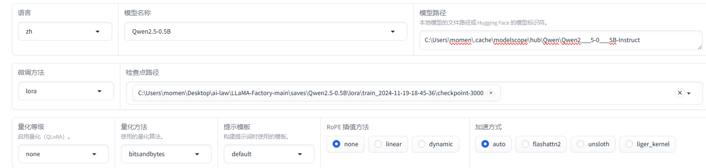
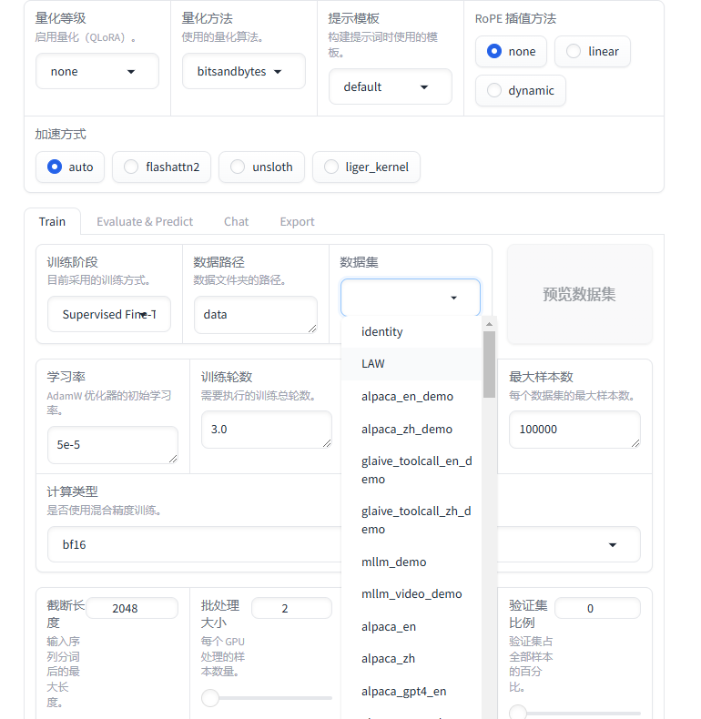
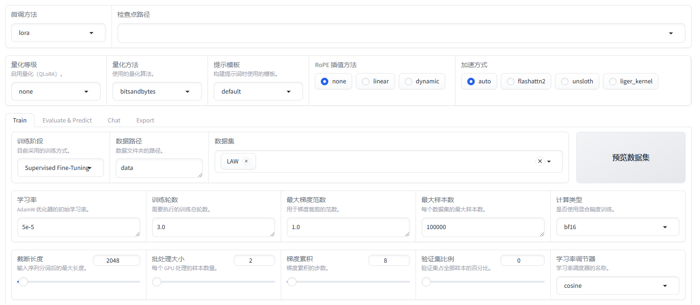
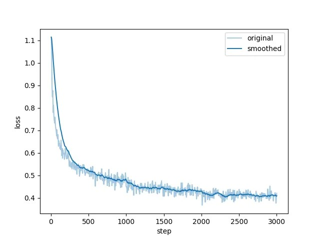
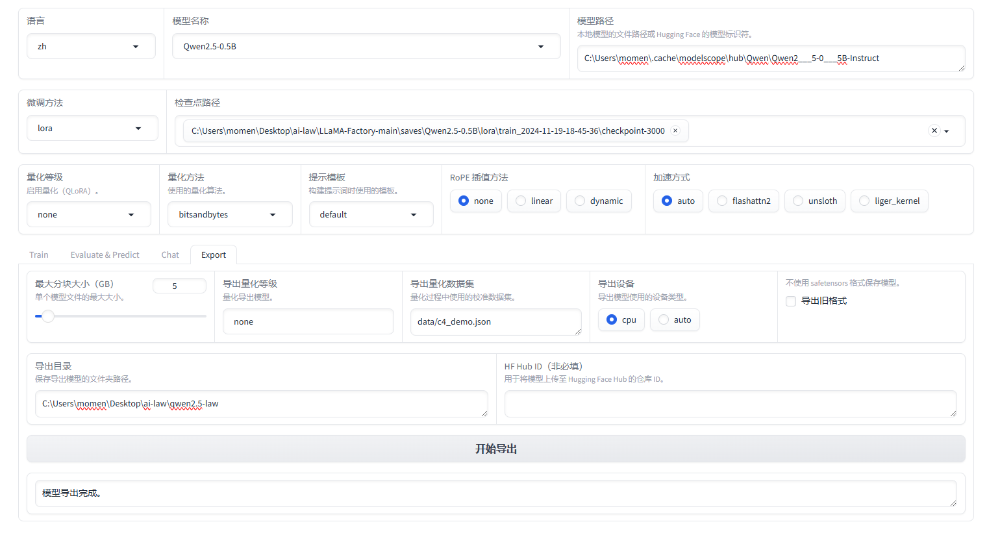

## 微调大模型
# 代码下载
https://github.com/hiyouga/LLaMA-Factory

# 模型下载
 git clone https://www.modelscope.cn/LLM-Research/Meta-Llama-3-8B-Instruct.git

## 准备环境
`conda create -n llama_factory python=3.11.1`

## 安装依赖
https://download.pytorch.org/whl/torch_stable.html

将文件放在项目根目录
`pip install "torch-2.2.1+cu121-cp311-cp311-win_amd64.whl" --user`

`pip install tensorboard`

# 模型微调

## 导入自定义数据集
文件管理器 `~\ai-law\LLaMA-Factory-main\data`
下有一个dataset_info.json，按格式添加即可

## 打开web界面模型微调
`llamafactory-cli webui`
http://localhost:7860/

## 待微调的模型导入
然后选择模型名称，填入模型路径

## 微调
选择需要的模型，如LAW法律模型
法律模型源自：https://modelscope.cn/datasets/Robin021/DISC-Law-SFT

数据集文件->数据文件->DISC-Law-SFT-Triplet-released.jsonl
然后需要进行alpaca格式化。

此时可以先不做任何修改，然后开始训练

## 训练时
这个图表是一个训练过程中的损失曲线图（Loss Curve），通常用于跟踪模型在训练过程中损失（Loss）的变化。以下是图中各部分的解释：

x轴（step）：

表示训练的步数（Step），即模型更新参数的次数。通常每个 Step 代表处理一批数据（Batch）的梯度更新。
y轴（loss）：

表示模型的损失值（Loss），用来衡量模型的预测结果与真实结果的偏差。损失越小，模型的预测越接近真实值。
两条曲线：

original（浅蓝色曲线）：表示未平滑处理的原始损失值。这条曲线可能会因为数据噪声或梯度波动而显得不平稳。
smoothed（深蓝色曲线）：表示经过平滑处理的损失值，更加直观地反映总体趋势。
曲线趋势：

从图中可以看到，损失值随着步数的增加逐渐减小，说明模型在不断学习，性能在提升。
最后损失趋于平稳，表明模型逐步接近收敛。
图的意义：
模型学习效果：损失值逐步降低，表示模型的训练正常进行中。
平滑曲线：用于观察整体趋势，避免原始损失的波动干扰。
调试提示：如果曲线出现明显的震荡、不收敛或者损失反弹，可能表明模型的学习率设置过高或其他问题。

## 训练后
选择检查点路径找生成后的文件。然后再写入导出路径即可。
导出后可以用上文同样方法，与模型对话，验证一下。

## 小结
